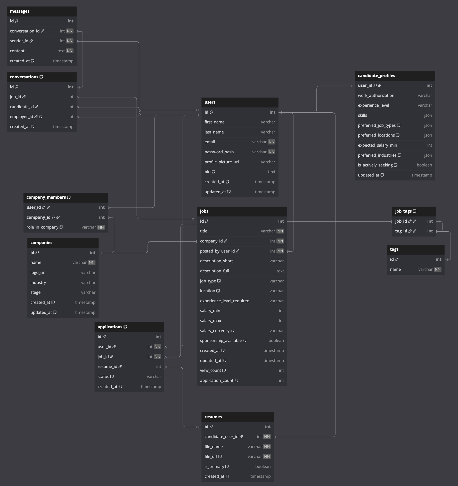

# Database Schema README

## 1\. Overview

This document outlines the database schema for the JobHatch platform. The schema is designed to be clean, scalable, and easy to work with, supporting all core features of the job board application.

The complete schema is defined in the `db_schema.dbml` file. This README explains the structure, key relationships, and the design decisions made.

## 2\. Core Design Principles

Our design was guided by a few key ideas:

 #### **1. Flexible User Roles**
We separated a user's identity (`users` table) from their roles on the platform. This means a single user can be both a job seeker (`candidate`) and an employer (`employer`) at the same time, which is crucial for a flexible platform. A user's role is determined by whether they have a `candidate_profiles` record or a `company_members` record.

#### **2. Evolving Profiles for Matching and Growth**
Instead of a static form, the `candidate_profiles` table is designed as a rich "data hub" that can evolve with the user. This was done to support both job matching and future personal growth features.

* **A Hybrid Data Model for Structure and Flexibility:** We use a mix of data types to get the best of both worlds.
    * For single-value attributes like `experience_level`, we use standard `varchar` fields. This is efficient and ensures data consistency.
    * For attributes where a user can have **multiple selections** (like `skills`, `preferred_job_types`, or `preferred_locations`), we use the `JSON` type to store an array (e.g., `['Full-time', 'Contract']`). This approach is far superior to using a simple comma-separated string because it's structured, easier to query efficiently, and avoids the complexity of creating many extra "join" tables for simple preferences.

* **Foundation for Precise Job Matching:** This rich profile data, containing both what a candidate *has* (skills, experience) and what they *want* (job preferences), provides a solid foundation for a matching engine. The system can now compute a more accurate match score by comparing these structured attributes against a job's requirements.

* **Enabling Personal Growth Records:** The schema is designed to track a user's journey. As a candidate adds new `skills` or updates their `experience_level`, their profile evolves. This design prepares the platform for future features like suggesting relevant courses, visualizing a user's career progression, or identifying skill gaps for a desired job.

## 3\. Entity Relationship Diagram (ERD)

The diagram below shows the tables and their relationships.

## 4\. Table Breakdown

| Table | Purpose |
| :--- | :--- |
| **`users`** | Stores the core identity and login information for every person on the platform. |
| **`candidate_profiles`** | Holds a candidate's complete job-seeking profile. This includes their professional details (skills, experience) and their job preferences (desired salary, location, etc.). |
| **`resumes`** | Stores references to multiple resume files for each candidate, allowing them to tailor applications for different roles. |
| **`companies`** | A simple list of all companies registered on the platform. |
| **`company_members`** | A linking table that defines a user's role within a company (e.g., 'founder', 'hr'). This is how a user becomes an employer. |
| **`jobs`** | Contains all the details and requirements for each job posting. |
| **`tags`** | A master list of all possible tags (e.g., "Remote", "Senior Level"). This acts as our "dictionary" for tags. |
| **`job_tags`** | A linking table that connects `jobs` and `tags` in a many-to-many relationship. |
| **`applications`** | Tracks the event of a user applying for a job, linking the `user`, the `job`, and the specific `resume` used for the application. |
| **`conversations`** | **[Extension]** Represents a chat thread between a candidate and an employer. |
| **`messages`** | **[Extension]** Stores all messages within a conversation. |

## 5\. Key Relationships Explained

This section breaks down how the tables connect to create the core logic of the platform, with a primary focus on the interactions between users and jobs.

#### How a Candidate Applies for a Job
A `user` does not directly connect to a `job`. The relationship is established through the **`applications`** table, which records the "event" of applying.

* A user who wants to apply for a job must have a profile in the **`candidate_profiles`** table.
* When they apply, a new row is created in `applications`. This row acts as a bridge, linking three things together:
    1.  `user_id`: Who is the applicant?
    2.  `job_id`: Which job are they applying to?
    3.  `resume_id`: Which one of their resumes did they use for this specific application?
* This creates a many-to-many relationship between users and jobs, where `applications` is the linking table that stores the history of these interactions.

#### How an Employer Posts a Job
This relationship defines who has the authority to create job listings for a company.

* A `job` record contains a `company_id` and a `posted_by_user_id`.
* However, not just any user can post a job for any company. The **`company_members`** table is the source of truth here. A user can only post a job for a company if they have a corresponding entry in the `company_members` table that links their `user_id` to that `company_id`.
* This ensures that only authorized founders, HR, or recruiters can post jobs on behalf of their company.

#### How a Candidate's Profile Matches a Job
This is a **logical relationship**, not a direct foreign key link. The matching is performed by the application's backend logic by comparing data from two separate tables:

* **`candidate_profiles`**: Contains what the candidate *has* (e.g., `skills`, `experience_level`) and what they *want* (`preferred_locations`, `expected_salary_min`).
* **`jobs`**: Contains what the job *requires* (e.g., `experience_level_required`, `sponsorship_available`) and what it *offers* (`location`, `salary_min`).

The backend fetches data from both tables and calculates a match score based on how well the candidate's profile aligns with the job's details.

#### Other Key Relationships

* **A Candidate's Resumes:** A `user` has a **one-to-many** relationship with the `resumes` table. One candidate can have multiple resumes, allowing them to tailor them for different job types.
* **Jobs and Tags:** A `job` has a **many-to-many** relationship with `tags`, linked through the `job_tags` table. This allows a job to be categorized with multiple descriptive tags.

## 6\. Key Design Decisions

Our main goal was to design the user profile to be flexible, which makes it much easier for the backend to build a powerful job matching feature. We used a practical approach for the `candidate_profiles` table: standard fields for simple data like `experience_level`, and flexible `JSON` fields for attributes where a user can have multiple options, like `skills` or `preferred_job_types`. This design allows the backend to easily read a candidate's list of preferences and compare them against job requirements. We also created a separate `resumes` table so a candidate can manage several different resume files, which simplifies the logic for tracking which resume was used for each job application.

To ensure the entire database structure is clean and reliable, we made deliberate choices about how entities relate to each other. For instance, rather than using simple text for job tags, we created a central `tags` table and a `job_tags` linking table. This design guarantees that tags are consistent across the platform (e.g., no typos like "New Grad" vs "new grad") and makes the system much easier to manage and search. Similarly, the `company_members` table clearly defines the relationship between users and companies, which not only organizes the data cleanly but also creates a foundation for future permission systems, such as defining who has the authority to post a job for a company.

## 7\. How to Use

The full schema is defined in the `db_schema.dbml` file. You can open this file in any text editor or import it into a compatible tool like [dbdiagram.io](https://dbdiagram.io) to visualize and explore the schema.