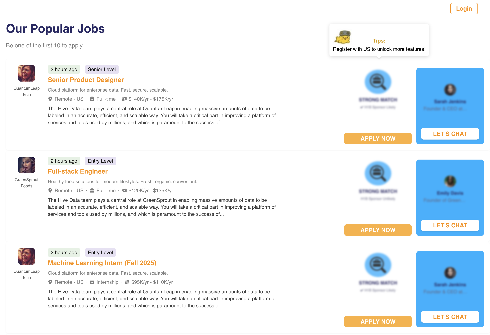
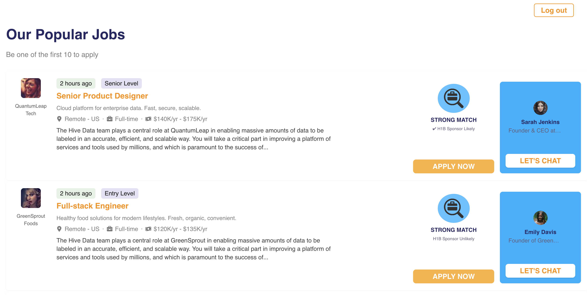

# Job Board Frontend

A modern job board interface built with React, featuring job listings with match indicators and founder information.

## Quick Start

```bash
# Install dependencies
npm install

# Start development server
npm run dev
```

The application will be available at `http://localhost:*`

## Demo





*Job listing card with match indicator and founder information*
